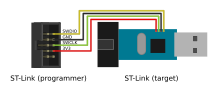
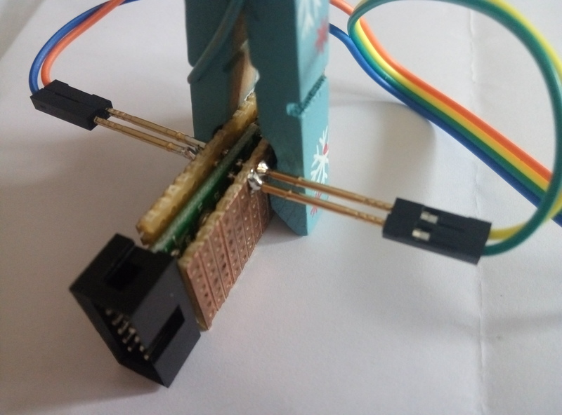
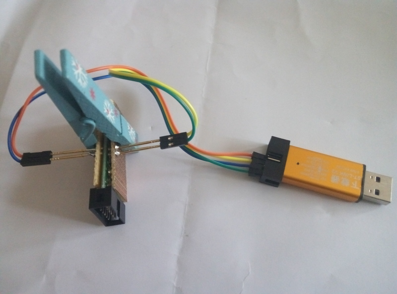
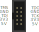

# DirtyJTAG

DirtyJTAG is a JTAG adapter firmware for $2 ST-Link clones and generic STM32 development boards ("blue pill"/"black pill" STM32F101-based ARM boards). The DirtyJTAG project was created to find an alternative to the obsolete (but cheap) LPT Wiggler cables, and expensive USB JTAG probes.

DirtyJTAG is dirty and dirt cheap, but is not fast nor a perfect implementation of the JTAG protocol. Yet it is around 500 sloccount lines, therefore it is easily understandable and hackable.

DirtyJTAG is supported in mainline UrJTAG, see the [Installing UrJTAG with DirtyJTAG support](#installing-urjtag-with-dirtyjtag-support) section.

If you prefer OpenOCD to UrJTAG, I suggest using Zoobab's fork of Versaloon firmware, which is available [on his GitHub repository](https://github.com/zoobab/versaloon).

## Complete instructions for installing DirtyJTAG on a $2 chinese ST-Link clone

The $2 chinese ST-Link clones that you can find on Aliexpress/eBay are based on a STM32F101 chip. They can be repurposed into a JTAG adapter using the DirtyJTAG firmware. However, due to the limited number of GPIO available to the user, only the bare minimum JTAG pins are available : `TDI/TDO/TMS/TCK` (no `SRST` or `TRST`).

### Taking apart the adapter

Press firmly the USB connector on a flat surface while holding the outer aluminium casing. This will release the PCB from its casing.


### Install DirtyJTAG firmware

In order to install a newer firmware, you will need a SWD programmer. I chose to use another $2 ST-Link programmer. Connect them together like this :



Do not plug your ST-Link (target) in a USB port yet. Install [stlink](https://github.com/texane/stlink) on your computer, and download a compiled release of DirtyJTAG for ST-Link adapters ([available here](https://github.com/jeanthom/dirtyjtag/releases)). Enter this command to program the STM32 :

```
st-flash write /path/to/dirtyjtag-stlink.bin 0x8000000
```

If for some reason the flashing process fails because the reported flash size is 0, [there is a fix](https://github.com/texane/stlink/issues/172#issuecomment-347887271).

If you have pogopins around, you could make your own flashing jig by soldering 4 of those on 2 pieces of stripboard, and hold them with a clothespin:




### Using your *brand new* DirtyJTAG dongle with a JTAG target

This is the new pinout for your DirtyJTAG dongle. You may want to print it and glue it to the case for practical reasons.



Install [UrJTAG with DirtyJTAG support](#installing-urjtag-with-dirtyjtag-support). Plug your DirtyJTAG dongle, and check with the `lsusb` command that a new device with `0x1209/0xC0CA` as its USB VID/PID has appeared.

```
$ jtag
UrJTAG 0.10 #
Copyright (C) 2002, 2003 ETC s.r.o.
Copyright (C) 2007, 2008, 2009 Kolja Waschk and the respective authors

UrJTAG is free software, covered by the GNU General Public License, and you are
welcome to change it and/or distribute copies of it under certain conditions.
There is absolutely no warranty for UrJTAG.

warning: UrJTAG may damage your hardware!
Type "quit" to exit, "help" for help.

jtag> cable dirtyjtag
jtag> detect

```

## Installing DirtyJTAG on a standard STM32 developement board

The procedure is the same as above : download a pre-built version of the firmware (available [on the release page](https://github.com/jeanthom/dirtyjtag/releases)) or build the firmware yourself (instructions provided below). Install [stlink](https://github.com/texane/stlink), then use this command :

```
st-flash write /path/to/dirtyjtag.bin 0x8000000
```

The `bluepill` build of DirtyJTAG has the following pinout :

| STM32 | JTAG |
|-------|------|
| PA0   | TDI  |
| PA1   | TDO  |
| PA2   | TCK  |
| PA3   | TMS  |
| PA4   | TRST |
| PA5   | SRST |

If needed, pin definition can be modified in `src/jtag.c`.

## USB VID and PID

Once the bluepill dongle has been flashed, you should see the following USB VID=1209
and PID=c0ca belonging to "InterBiometrics" once plugged in on a linux computer:

```
$ lsusb
[...]
Bus 002 Device 003: ID 1209:c0ca InterBiometrics
```

The VID/PID was obtained through http://pid.codes, which is a registry of USB
PID codes for open source hardware projects.

More infos: http://pid.codes/1209/C0CA/

## Installing UrJTAG with DirtyJTAG support

Mainline UrJTAG has DirtyJTAG support since [763bbc](https://sourceforge.net/p/urjtag/git/ci/763bbce1213f5759e2925773d0dd5f3b537368f6/tree/) revision. However, most package sources still use 2011 UrJTAG sources, so you'll need to compile UrJTAG :

```bash
cd /tmp
git clone https://git.code.sf.net/p/urjtag/git urjtag-git
cd urjtag-git/urjtag/
./autogen.sh
make
sudo make install
```

Then, you can use DirtyJTAG like any other JTAG cable in UrJTAG :

```text
$ jtag
UrJTAG 0.10 #
Copyright (C) 2002, 2003 ETC s.r.o.
Copyright (C) 2007, 2008, 2009 Kolja Waschk and the respective authors

UrJTAG is free software, covered by the GNU General Public License, and you are
welcome to change it and/or distribute copies of it under certain conditions.
There is absolutely no warranty for UrJTAG.

warning: UrJTAG may damage your hardware!
Type "quit" to exit, "help" for help.

jtag> cable dirtyjtag
jtag>
```

## DirtyJTAG compilation

In order to compile DirtyJTAG, you will need the following software :

 * git
 * ARM toolchain (I'm using Fedora's `arm-none-eabi-gcc-cs`/`arm-none-eabi-newline` packages)
 * make

Clone this repository :

```
git clone https://github.com/jeanthom/dirtyjtag
cd dirtyjtag
```

Then download unicore-mx :

```
git submodule init
git submodule update
```

Then you can build the firmware :

```
make bin PLATFORM=bluepill
```

Currently there are two platforms :

 * bluepill : Default build setting
 * stlinkv2 : Chinese ST-Link clone with specific pinout

Once the build is completed, your freshly compiled firmware will be available in `src/dirtyjtag.bin`.

## Inspiration

 * [opendous-jtag](https://github.com/vfonov/opendous-jtag)
 * [neroJtag](https://github.com/makestuff/neroJtag)
 * [clujtag-avr](https://github.com/ClusterM/clujtag-avr)
