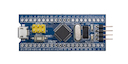
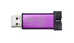
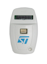
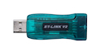
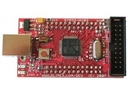

# DirtyJTAG

[](https://travis-ci.org/jeanthom/DirtyJTAG)

DirtyJTAG is a JTAG adapter firmware for $2 ST-Link clones and generic STM32 development boards ("blue pill"/"black pill" STM32F101 and STM32F103 based ARM boards). The DirtyJTAG project was meant to be an alternative to the obsolete (but cheap) LPT Wiggler cables, and other expensive USB JTAG probes.

DirtyJTAG is dirty and dirt cheap, but is not fast nor a perfect implementation of the JTAG protocol. Yet it is around 1k sloccount lines, making it easily understandable and hackable.

If you prefer OpenOCD to UrJTAG, I suggest using Zoobab's fork of Versaloon firmware, which is available [on his GitHub repository](https://github.com/zoobab/versaloon).

## Build your DirtyJTAG adapter

| Bluepill                                    | ST-Link v2 clone (dongle)                                                               | ST-Link v2 clone (white case)                 | "Baite" ST-Link v2 clone                |
|:-------------------------------------------:|:---------------------------------------------------------------------------------------:|:---------------------------------------------:|:---------------------------------------:|
|  |                                          |   |  |
| [Instructions](docs/install-bluepill.md)    | [Instructions](docs/install-stlinkv2-swd.md) | [Instructions](docs/install-stlinkv2white.md) | [Instructions](docs/install-baite.md)       |

| Olimex STM32-H103                              |
|:----------------------------------------------:|
|  |
| No instructions yet                            |

## Software compatible with DirtyJTAG

 * [UrJTAG](docs/urjtag-dirtyjtag.md): support added in 2017.10
 * [openFPGAloader](docs/openfpgaloader-dirtyjtag.md): support added in v0.1

## USB VID and PID

All DirtyJTAG-flashed devices appear with the following USB VID=0x1209/PID=0xC0CA
(which belongs to "InterBiometrics") :

```
$ lsusb
[...]
Bus 002 Device 003: ID 1209:c0ca InterBiometrics
```

The PID was obtained through http://pid.codes, which is a registry of USB
PID codes for open source hardware projects. More infos: http://pid.codes/1209/C0CA/

`dmesg` also give some output where you can see the manufacturer field as "Jean THOMAS":

```
$ dmesg
[...]
[55444.904830] usb 1-3: new full-speed USB device number 12 using xhci_hcd
[55445.033099] usb 1-3: New USB device found, idVendor=1209, idProduct=c0ca, bcdDevice= 1.10
[55445.033105] usb 1-3: New USB device strings: Mfr=1, Product=2, SerialNumber=3
[55445.033108] usb 1-3: Product: DirtyJTAG
[55445.033111] usb 1-3: Manufacturer: Jean THOMAS
[55445.033114] usb 1-3: SerialNumber: 55FF6E064980515631491787
```

Older versions of DirtyJTAG reported "DirtyJTAG" as the manufacturer, this bug has since been fixed.

## Some docs

 * [Compiling DirtyJTAG yourself](docs/building-dirtyjtag.md)
 * [Validate your DirtyJTAG cable with JTAG targets](docs/jtag-validation.md)
 * [Fixing STM32F1xx flash protection issues](docs/stm32f1-flash-protection.md)

## Inspiration & links

 * [opendous-jtag](https://github.com/vfonov/opendous-jtag)
 * [neroJtag](https://github.com/makestuff/neroJtag)
 * [clujtag-avr](https://github.com/ClusterM/clujtag-avr)
 * [CuVoodoo page on JTAG and ST-Link v2 adapters](https://wiki.cuvoodoo.info/doku.php?id=jtag)
 * [versaloon jtag](https://github.com/zoobab/versaloon)
 * [blackmagic probe on st-link-v2 clones](https://madnessinthedarkness.transsys.com/blog:2017:0122_black_magic_probe_bmp_on_st-link_v2_clones)
 * [ST-Link clone repurposing](https://hackaday.io/project/162597-st-link-clone-repurposing)
 * [ST-Link clone as STM32 dev board](https://blog.danman.eu/st-link-clone-as-stm32-dev-board/)
 * [Repurpose an ST-Link clone](https://www.hobbiton.be/blog/repurpose-stlink/)
