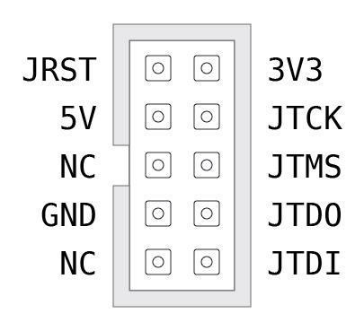

# Installing DirtyJTAG on a "Baite" ST-Link clone

Baite dongles are cheap SWD programmer dongles that are widely avaiable on chinese marketplaces. Unlike their [aluminium counterparts](install-stlinkv2.md), they have an extra pin for JTAG reset.

## Requirements

 * A Baite dongle
 * An ST Link v2-compatible SWD programmer
 * [stlink](https://github.com/texane/stlink) and OpenOCD installed on your computer

## SWD wiring

To gain access to the internal SWD connector in your Baite dongle, pry apart the case at the header connector. The two halves hold the case in place using weak plastic retainer clips, you should be able to take it apart without any tool.


The unpopulated connector can fit a generic 2.54mm male header if needed. When programming the Baite dongle, **it is advised to not plug the Baite dongle via USB** to avoid confusion while flashing DirtyJTAG (you might brick your ST-Link programmer!).

## Remove flash protection

Any ST-Link currently sold (even the clones) have their readout protection enabled. This means that when you want to flash another firmware than the factory-supplied one, you will have to disable the read protection using OpenOCD. Hopefully you will only have to do it once!

Connect the ST-Link that will act as a programmer to the target on its SWD header. Open up a terminal and type in the following command:

```
openocd -f interface/stlink-v2.cfg -f target/stm32f1x.cfg
```

You might get an error similar to
```
Warn : UNEXPECTED idcode: 0x2ba01477 Error: expected 1 of 1: 0x1ba01477
```
which indicates that your ST-Link V2 clone has a STM32 clone MCU.

In this case, create a custom config file with the reported idcode, eg "`my-stlink-v2.cfg`" with the content:
```
source [find interface/stlink-v2.cfg]
set CPUTAPID 0x2ba01477
```
and substitute `-f interface/stlink-v2.cfg` with `-f my-stlink-v2.cfg` when invoking openocd.

Now while keeping this terminal open, open another one and connect to the OpenOCD server:

```
telnet localhost 4444
```

Then type in the following commands to reset the readout protection and exit the telnet session:

```
halt
stm32f1x unlock 0
reset
exit
```

You can `CTRL+C` on the OpenOCD terminal to terminate it.

More detailed explanations are available in [a separate documentation page](stm32f1-flash-protection.md).

## Flashing DirtyJTAG

Download a binary version of DirtyJTAG (make sure to get the `baite` build!) or [compile it yourself](building-dirtyjtag.md), then flash it using `st-flash`:

```
st-flash write /path/to/dirtyjtag.baite.bin 0x8000000
```

## Pinout


