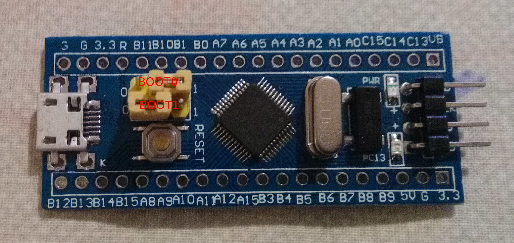
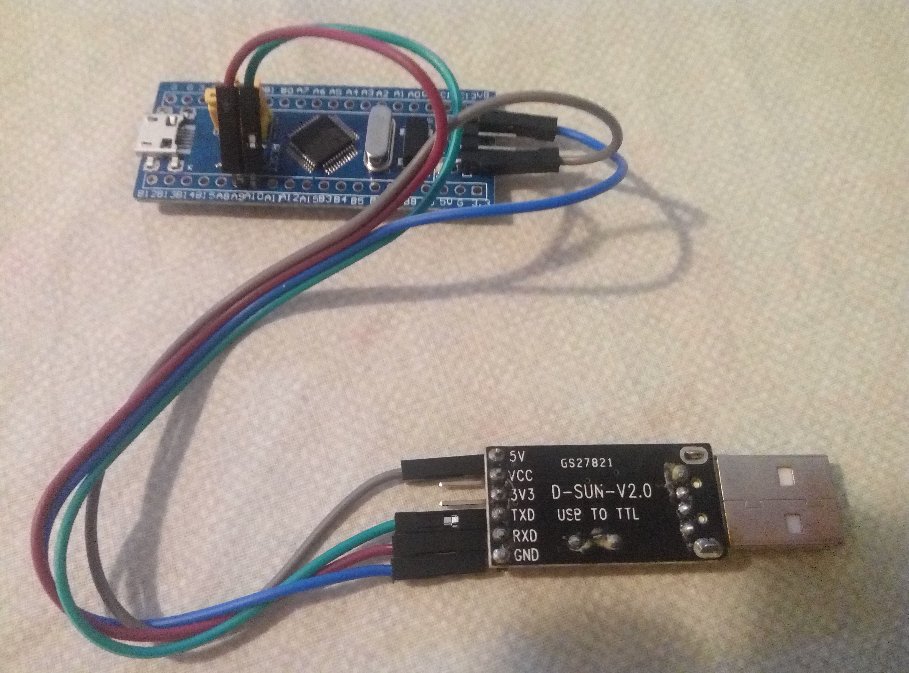
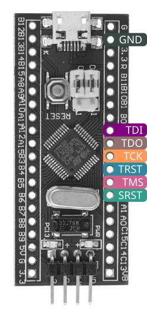

# Installing DirtyJTAG on a Blue Pill STM32 developement board

The procedure is the same as for the [ST-Link v2](install-stlinkv2.md) : download
a pre-built version of the firmware (available
[on the release page](https://github.com/jeanthom/dirtyjtag/releases)) or
build the firmware yourself (instructions provided below).

## Buying a Blue Pill development board

These boards are easily obtained through Aliexpress or eBay for less than $2 shipped.

## Via an ST-Link-v2 dongle

Install [stlink](https://github.com/texane/stlink), then use this command :

```
st-flash write /path/to/dirtyjtag.bin 0x8000000
```

## Via a USB-serial adaptor

You can flash DirtyJTAG with a usb-serial dongle (such as based on chips such
as wch340g, pl2303, cp2102, ft232r, etc...). In the following example, we use a
cheap ch340g usb-serial dongle with can be bought on Aliexpress for 0.67USD.

Before flashing, you have to put the yellow jumpers `BOOT0` to 1, and keep `BOOT1`
at 0, like on the following picture:



If you don't want to solder the yellow 2 rows of headers on the side of the
board, you can prepare 2 bended pins at the end of 2 female-to-female wires,
and connect them to A9 and A10, while pressing the head againt the jumpers
block to maintain stability.



You have to connect:

| USB-SERIAL  | BLUEPILL |
|-------------|----------|
| 5V(or 3.3V) | SWD_3.3  |
| GND         | SWD_GND  |
| TX          | A10      |
| RX          | A9       |

Note that the flashing works with either 5V or 3V3 as supplied voltage from
the USB-serial adaptor.

Then, you have to install `stm32flash`, which can be obtained in your
distribution (`apt-get install stm32flash` for debian/ubuntu), and flash the
firmware with this command:

```
$ stm32flash -w dirtyjtag.bluepill.bin -v /dev/ttyUSB0
stm32flash 0.5

http://stm32flash.sourceforge.net/

Using Parser : Raw BINARY
Interface serial_posix: 57600 8E1
Version      : 0x22
Option 1     : 0x00
Option 2     : 0x00
Device ID    : 0x0410 (STM32F10xxx Medium-density)
- RAM        : 20KiB  (512b reserved by bootloader)
- Flash      : 128KiB (size first sector: 4x1024)
- Option RAM : 16b
- System RAM : 2KiB
Write to memory
Erasing memory
Wrote and verified address 0x08002028 (100.00%) Done.

Starting execution at address 0x08000000... done.
$
```

Then unplug it, put back the `BOOT0` jumper to 0, and plug it in USB, you should
see the "1209:c0ca InterBiometrics" in the output of `lsusb`:

```
$ lsusb
Bus 001 Device 004: ID 2232:1024 Silicon Motion 
Bus 001 Device 003: ID 8087:07da Intel Corp. 
Bus 001 Device 002: ID 8087:0024 Intel Corp. Integrated Rate Matching Hub
Bus 001 Device 001: ID 1d6b:0002 Linux Foundation 2.0 root hub
Bus 003 Device 001: ID 1d6b:0003 Linux Foundation 3.0 root hub
Bus 002 Device 004: ID 1209:c0ca InterBiometrics 
Bus 002 Device 001: ID 1d6b:0002 Linux Foundation 2.0 root hub
```

## Pinout

The `bluepill` build of DirtyJTAG has the following pinout :

| STM32 | JTAG |
|-------|------|
| PA7   | TDI  |
| PA6   | TDO  |
| PA5   | TCK  |
| PA3   | TMS  |
| PA4   | TRST |
| PA2   | SRST |



If needed, pin definition can be modified in `src/jtag.c`.

## Blackpill compatibility

The same bluepill firmware has been also been tested successfully on a [Blackpill board](https://web.archive.org/web/20190220175310/http://wiki.stm32duino.com/index.php?title=Black_Pill).
