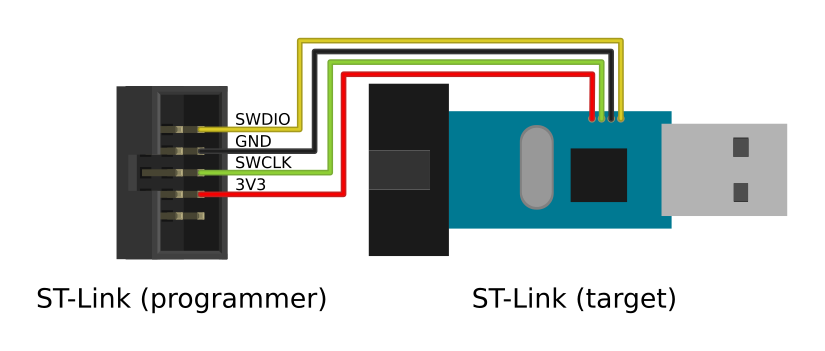
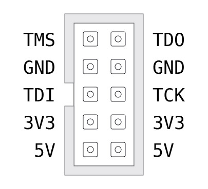

# Installing DirtyJTAG on a ST-Link clone dongle

ST-Link clone dongles are the cheap dongles you can find on AliExpress. They provide the minimum amount of signals needed for JTAG operation. They currently require an SWD programmed in order to install DirtyJTAG on it.

## Requirements

 * ST-Link v2 dongle
 * An ST Link v2-compatible SWD programmer
 * [stlink](https://github.com/texane/stlink) and OpenOCD installed on your computer

## SWD wiring

To gain access to the internal SWD connector in your ST-Link dongle, press firmly the USB connector againt a flat surface while holding the outer aluminium casing as shown:




If you don't want to solder to your ST-Link dongle, you can either use [dupont header cables](img/stlinkv2-header-cable.jpg) or like zoobab hack a small jig with pogo pins ([[1]](img/stlinkv2-jig-1.jpg), [[2]](img/stlinkv2-jig-2.jpg)).

## Unlocking the memory

Like every other ST-Link clone on the market, its flash memory is protected against SWD readouts. To remove that protection we will have to use OpenOCD.

To start OpenOCD with the adequate settings for an ST-Link v2 programmer use this command:

```
openocd -f interface/stlink-v2.cfg -f target/stm32f1x.cfg
```

Then while keeping OpenOCD open, open a new terminal window and connect to OpenOCD server:

```
telnet localhost 4444
```

You now have an OpenOCD prompt (congratulations!). You may now enter the following OpenOCD commands to reset the MCU flash protection (and its content by the way).

```
halt
stm32f1x unlock 0
reset
exit
```

## Flashing DirtyJTAG

Download a binary version of DirtyJTAG (make sure to get the `baite` build!) or [compile it yourself](building-dirtyjtag.md), then flash it using `st-flash`:

```
st-flash write /path/to/dirtyjtag.stlinkv2.bin 0x8000000
```

## Pinout



A print friendly version [is also available](img/stlinkv2-sticker.svg).
