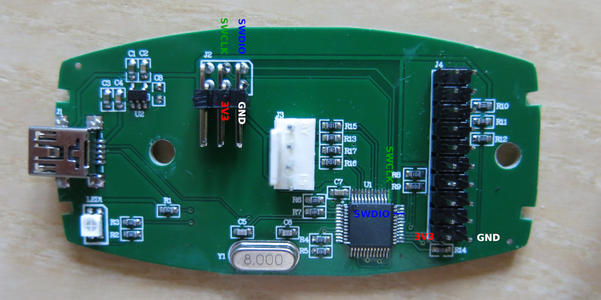

# Complete instructions for installing DirtyJTAG on a chinese ST-Link clone (white pod version)

Those clones are a rough replica of what ST Microelectronics sells as "ST-LINK/V2" through many electronic component sellers. Unlike the official ST-Link v2, the chinese clones do not have features like I/O buffering with user settable voltage.

## Buy an ST-Link clone

These boards are widely available on internet marketplaces (AliExpress, Amazon, taobao, etc.) for around 6€.

## Prerequisites

 * A second ST-Link programmer
 * Spare .1" 2x3 (or 1x2) header (preferably right-angled)
 * [OpenOCD](http://openocd.org)
 * [stlink](https://github.com/texane/stlink)

## Installing SWD headers on the ST-Link

As the ST-Link is shipped flashed there is no need for the end user for an SWD header (in a normal use case). To install one you have to take apart the ST-Link pod by unscrewing its back (there are [two screws](https://youtu.be/zXENCKrPQMc?t=106) hidden under the label) and solder a 0.1" header to the PCD.

This should be the pinout of the relevant signals (unless otherwise indicated on the PCB):



To be safe, you should confirm the pinout with a continuity tester:

1. The SWDIO and SWCLK pins [are on the MCU's pins 34 and 37, respectively](https://www.hobbiton.be/blog/repurpose-stlink/#programming-pins)
2. 3V3 and GND are also present on the 2x20 header (see "PINOUT" below)

A normal pin header won't fit the housing, so better use a right-angled connector, as shown in the photo. Also, you don't really need a 2x3 header, you get by with a 2x1 header for SWDIO and SWCLK and connecting 3V3 and GND to the 2x20 header.

## Remove write protection

Any ST-Link currently sold (even the clones) have their readout protection enabled. This means that when you want to flash another firmware than the factory-supplied one, you will have to disable the read protection using OpenOCD. Hopefully you will only have to do it once!

Connect the ST-Link that will act as a programmer to the target on its SWD header. Open up a terminal and type in the following command:

```
openocd -f interface/stlink-v2.cfg -f target/stm32f1x.cfg
```

You might get an error similar to
```
Warn : UNEXPECTED idcode: 0x2ba01477 Error: expected 1 of 1: 0x1ba01477
```
which indicates that your ST-Link V2 clone has a stm32 clone MCU.

In this case, create a custom config file with the reported idcode, eg "`my-stlink-v2.cfg`" with the content:
```
source [find interface/stlink-v2.cfg]
set CPUTAPID 0x2ba01477
```
and substitute `-f interface/stlink-v2.cfg` with `-f my-stlink-v2.cfg` when invoking openocd.

Now while keeping this terminal open, open another one and connect to the OpenOCD server:

```
telnet localhost 4444
```

Then type in the following commands to reset the readout protection and exit the telnet session:

```
halt
stm32f1x unlock 0
reset
exit
```

You can `CTRL+C` on the OpenOCD terminal to terminate it.

## Flashing DirtyJTAG

With your target ST-Link connected to the programmer ST-Link you can now flash DirtyJTAG:

```
st-flash write /path/to/dirtyjtag.stlinkv2white.bin 0x8000000
```

## Pinout


