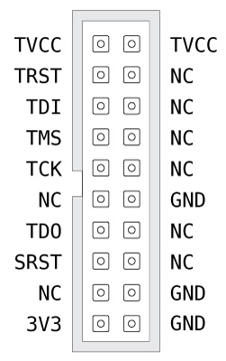

# Complete instructions for installing DirtyJTAG on a chinese ST-Link clone (white pod version)

In order to follow this tutorial, you will need an SWD programmer, like a $2 ST-Link dongle.

Those clones are a rough replica of what ST Microelectronics sells as "ST-LINK/V2" through many electronic component sellers.

## Buying an ST-Link clone

These boards can be bought for around 6€ (s&h incl.) on chinese marketplaces.

## Prerequisites

 * A second ST-Link programmer
 * Spare .1" headers
 * [OpenOCD](http://openocd.org)
 * [stlink](https://github.com/texane/stlink)

## Installing SWD headers on the ST-Link

To get started you will need to take apart your ST-Link pod. There are [two screws](https://youtu.be/zXENCKrPQMc?t=106) hidden beneath the label. Solder a 2x6 0.1" male hear to the unpopulated 2x6 connector. This is the connector you will use to program DirtyJTAG. The pinout should be written on the silkscreen.

## Remove write protection

Any ST-Link currently sold (even the clones) have their readout protection enabled. This means that when you want to flash another firmware than the factory-supplied one, you will have to disable the read protection using OpenOCD. Hopefully you will only have to do it once!

Connect the ST-Link that will act as a programmer to the target on its SWD header. Open up a terminal and type in the following command:

```
openocd -f interface/stlink-v2.cfg -f target/stm32f1x.cfg
```

Now while keeping this terminal open, open another one and connect to the OpenOCD server:

```
telnet localhost 4444
```

Then type in the following commands to reset the readout protection and exit the telnet session:

```
halt
stm32f1x unlock 0
reset
exit
```

You can `CTRL+C` on the OpenOCD terminal to terminate it.

## Flashing DirtyJTAG

With your target ST-Link connected to the programmer ST-Link you can now flash DirtyJTAG:

```
st-flash write /path/to/dirtyjtag.stlinkv2white.bin 0x8000000
```

## Pinout



