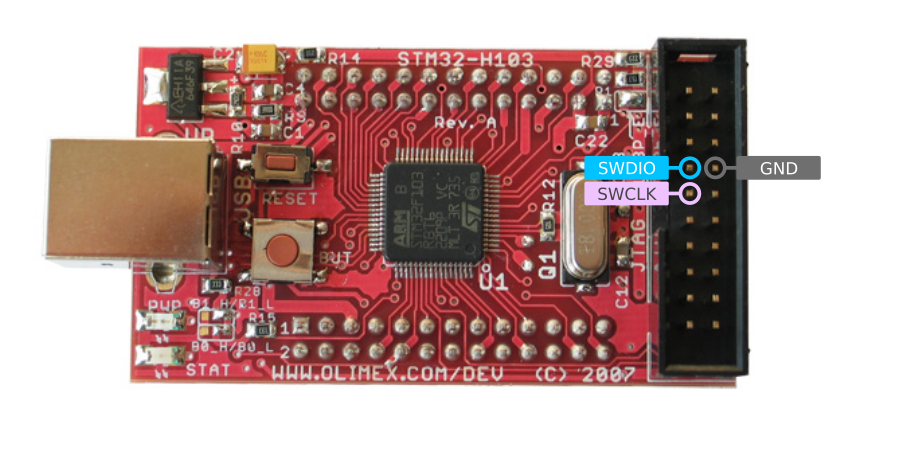
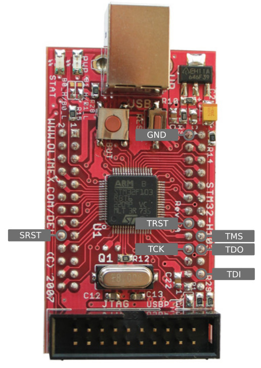

# Installing DirtyJTAG on Olimex STM32-H103

Thanks Olimex for gifting us this board! You can order it [on their website](https://www.olimex.com/Products/ARM/ST/STM32-H103/) (unsponsored link).

## Prerequisites

 * An ST-Link programmer
 * [stlink](https://github.com/texane/stlink)

## SWD wiring

The SWD signals are available on the HE20 JTAG connector:



## Flashing DirtyJTAG

Download a binary version of DirtyJTAG (make sure to get the `bluepill` build!) or [compile it yourself](building-dirtyjtag.md), then flash it using `st-flash`:

```
st-flash write /path/to/dirtyjtag.bluepill.bin 0x8000000
```

## Pinout

The STM32H103 uses currently the same pinout as Bluepill (if flashed with the `bluepill` firmware):


