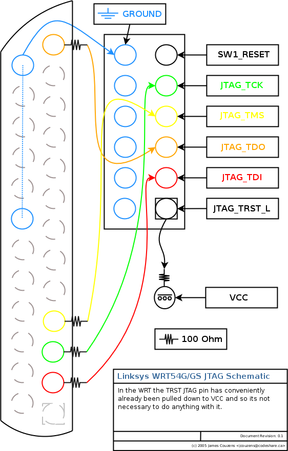
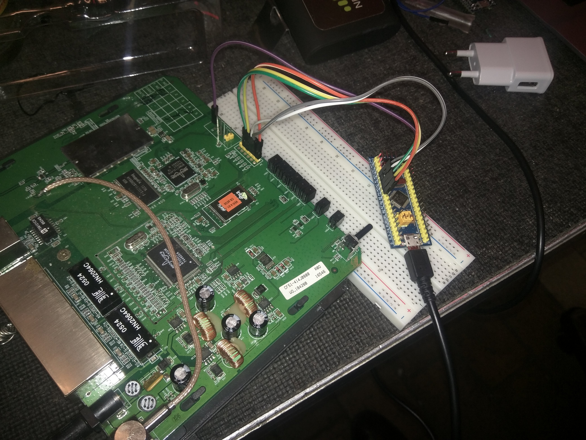

# JTAG Validation

You can validate that your DirtyJTAG cable works by using a target.

## JTAG Validation with $2 Blue Pill board

In this example we take another [Blue Pill](https://web.archive.org/web/20190527040051/http://wiki.stm32duino.com/index.php?title=Blue_Pilll) board which has JTAG pins exposed (yellow pins on the bluepill pinout):


You should be able to detect something:

```
jtag> cable DirtyJTAG
jtag> detect
IR length: 9
Chain length: 2
Device Id: 00111011101000000000010001110111 (0x3BA00477)
  Unknown manufacturer! (01000111011) (/usr/share/urjtag/MANUFACTURERS)
Device Id: 00010110010000010000000001000001 (0x16410041)
  Unknown manufacturer! (00000100000) (/usr/share/urjtag/MANUFACTURERS)
```

UrJTAG does not have support for STM32 MCUs : the MANUFACTURERS file (located in UrJTAG's `data/` folder) need to be updated with "ARM Ltd" and "SGS/Thomson" definitions :

```
$ grep 01000111011 manufacturers.txt
01000111011   ARM Ltd.

$ grep 00000100000 manufacturers.txt
00000100000   SGS/Thomson
```

## JTAG Validation on a Linksys WRT54G router

You can test the cable with a Linksys WRT54G router, which has a JTAG header where you need to solder the pins. The pinout is the following for a WRT54Gv22:



Here is a picture of the setup:



You should then be able to detect the chip:

```
jtag> cable DirtyJTAG
jtag> detect
IR length: 8
Chain length: 1
Device Id: 00100100011100010010000101111111 (0x2471217F)
  Manufacturer: Broadcom (0x17F)
  Part(0):      BCM4712 (0x4712)
  Unknown stepping! (0010) (/usr/share/urjtag/broadcom/bcm4712/STEPPINGS)
jtag>
```

Further documentation is needed on how to dump the flash. Some interesting webpage about a similar router:

[https://irgendwasistjaimmer.in-kiel.de/index.php?/archives/23-How-to-flash-a-new-CFE-into-your-bricked-Netgear-WGT634U.html](https://irgendwasistjaimmer.in-kiel.de/index.php?/archives/23-How-to-flash-a-new-CFE-into-your-bricked-Netgear-WGT634U.html)

Which makes UrJTAG segfaults :

```
jtag> discovery
[...]
Detecting DR length for IR 11111011 ... 1
Detecting DR length for IR 11111100 ... 1
Detecting DR length for IR 11111101 ... 1
Detecting DR length for IR 11111110 ... 1
jtag> initbus ejtag_dma
Initialized bus 5, active bus 0
jtag> detectflash 0x1fc00000
Segmentation fault (core dumped)
```
